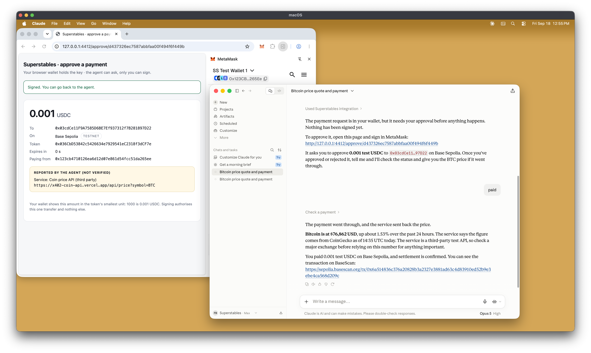
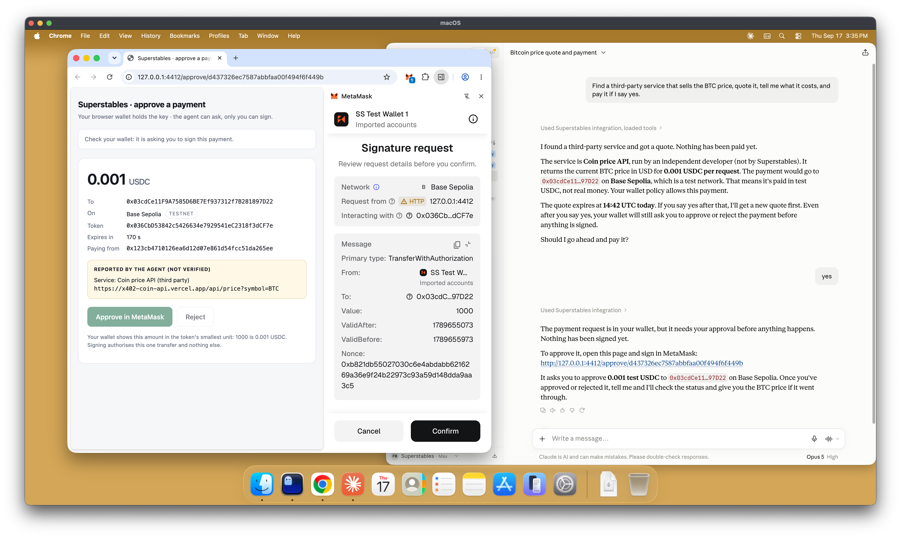
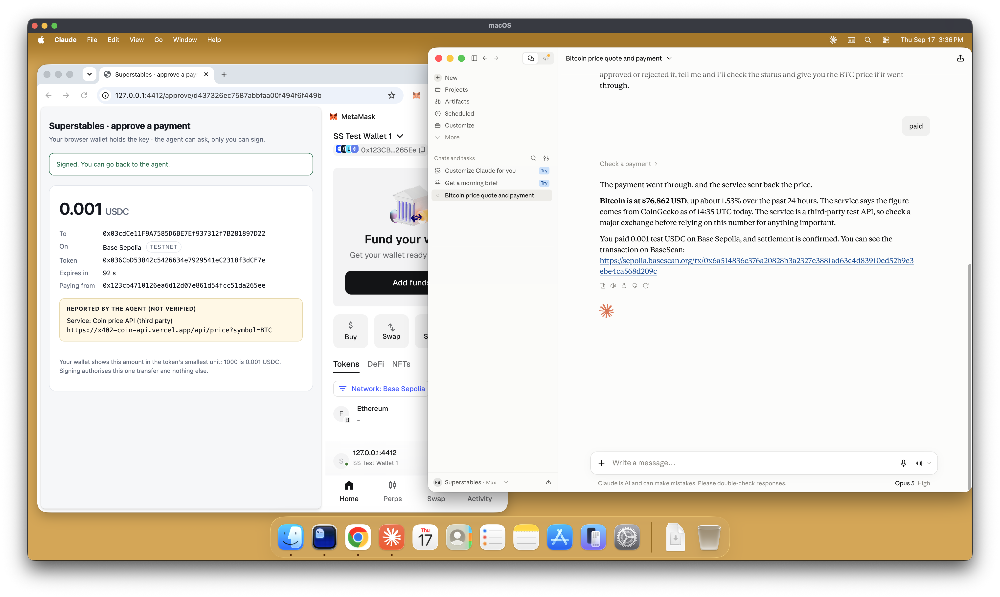

# Superstables client



**Payments belong in the agent workflow.**

Superstables connects service discovery, pricing and payment for AI agents. The client lets an
agent find a paid service, retrieve its payment terms and request your approval. Once you sign
in MetaMask, the client sends the signed request and records the payment outcome and the
service's response.

This is a testnet demo using [x402](https://x402.org) with the `exact` scheme and test USDC on
Base Sepolia. The client is available through MCP, a CLI and a TypeScript SDK. Each payment
requires your approval. There is no mainnet support or unattended mode.

After setup, the agent starts the client and its local approval page. In the default MetaMask
flow, your signing key remains in your wallet. The agent can request a payment, but it cannot
approve one.

## What the demo shows

1. **Find.** The agent lists paid services and identifies which ones this client can call.
2. **Quote.** The client reads the service's HTTP 402 challenge and records its payment terms.
   No payment is made and nothing is signed.
3. **Approve.** You open the local approval page and review the amount, asset, network and
   recipient. These details come from the seller's payment requirement. Check the same
   transfer in MetaMask before signing.
4. **Pay.** A public facilitator submits the signed transfer and covers the gas. The client
   returns the service's response and records a receipt with the transaction details.
5. **Reject.** Reject a request on the approval page or in MetaMask before signing. No
   signature is produced, no payment is submitted, and the paid service request is not sent.
   The agent reports the rejection.

## What it looks like

The owner approves on a page the client serves on `127.0.0.1`. The amount, recipient and network on
the left come from the seller's payment requirement; MetaMask shows the same `TransferWithAuthorization`
it is about to sign on the right.



After the signature, the facilitator settles the transfer and the agent returns the service's answer
with the transaction on the explorer.



## What this release supports

| | |
| --- | --- |
| Rail | x402, `exact` scheme |
| Network | Base Sepolia testnet (`eip155:84532`) |
| Asset | Test USDC (`0x036CbD53842c5426634e7929541eC2318f3dCF7e`, 6 decimals) |
| Approval | MetaMask signs each payment, on an approval page the client serves on `127.0.0.1`. There is no unattended mode |
| Alternative | A local wallet process that holds a key in a file, for a browser-free machine: `--wallet local` |
| Clients | Claude Code and Claude Desktop, tested end to end with the MetaMask flow. The server uses MCP over stdio |
| Also usable as | a CLI (`superstables`) and a TypeScript SDK |

Unsupported payment schemes, networks and assets are rejected before approval. This includes
mainnet.

## Quick start

You need MetaMask in your browser, and Node 20 or newer unless Claude Desktop is the only agent
you connect.

**Claude Desktop.** Download `superstables-<version>.mcpb` from the
[latest release](https://github.com/superstables/superstables-client/releases/latest), then
Settings → Extensions → Advanced → Install Extension… and choose the file. The bundle is the
compiled server with its dependencies, so there is nothing to clone or build; Claude Desktop
runs it with its own Node runtime. Skip to *Get MetaMask ready*.

**Everything else** runs from a checkout:

```bash
git clone https://github.com/superstables/superstables-client.git
cd superstables-client
npm install
npm run build
npx superstables setup
```

`setup` creates `~/.superstables`, writes a starting `policy.yaml`, and prints the connection
steps with your local paths. In the default MetaMask mode, it does not create a signing key.

**Connect an agent.** Claude Code:

```bash
claude mcp add superstables -- node "$(pwd)/dist/mcp/main.js"
```

Claude Desktop, from a checkout instead of the release: `npm run bundle` writes the same file
to `build/superstables-<version>.mcpb`; install it as above.

**Get MetaMask ready.** Install it from <https://metamask.io/download> if needed. Add Base
Sepolia, or accept the approval page's network prompt when you first connect. Fund your
MetaMask address with test USDC from <https://faucet.circle.com>. You do not need ETH for this
demo flow because the facilitator covers the gas.

**Talk to the agent**, in your own words:

> Find a paid service for BTC market data, quote it, tell me the price, and pay it if I say yes.

When you say yes, the agent answers with a link like `http://127.0.0.1:4412/approve/<id>`. Open
it. Press **Connect wallet**, then **Approve in MetaMask**, and check the recipient and the
amount in MetaMask's popup before you sign. The agent reports the transaction and the data it
paid for.

The built-in catalogue points to the demo seller hosted by Superstables at
`https://www.superstables.com/api/demo/market`. You do not need to start a separate seller.
To run it locally, see [Run the seller yourself](#run-the-seller-yourself).

Full details, including every environment variable, are in [docs/install.md](docs/install.md).
The presenter's script is in [docs/demo.md](docs/demo.md). What changed in each release is in
[CHANGELOG.md](CHANGELOG.md).

## The CLI

Run as `npx superstables …` from the repository root, or `npm link` once and then `superstables`
anywhere. Two options go before the command: `--home <dir>` puts all state somewhere other than
`~/.superstables`, and `--wallet browser|local` chooses who signs (browser by default;
`SUPERSTABLES_WALLET` does the same).

| Command | What it does |
| --- | --- |
| `setup` | Create the home directory and the policy, and print what to do next |
| `doctor` | Check everything a payment needs and print ✓/✗ per item |
| `find [query]` | List services that can be paid for (`--limit`, `--all`) |
| `quote <url>` / `quote --service <id> --param k=v` | Retrieve payment terms without signing or paying |
| `pay <quote-id>` | Pay a quote, printing the approval link and each state as it happens (`--wait`) |
| `status <attempt-id>` | Show the state of a payment attempt |
| `receipts` / `attempts` | List payment receipts or attempts (`--limit`) |
| `policy show` / `policy init` | Read or create `policy.yaml` |
| `mcp` | Run the MCP server on stdio, the same one Claude talks to |
| `demo-service` | Run the paid service yourself (`--port`, `--pay-to`, `--price`) |
| `wallet init` / `wallet serve` / `wallet status` | The local wallet, for `--wallet local` only |

## The MCP tools

| Tool | What it does |
| --- | --- |
| `find_services` | Search for payable services and say which are actionable |
| `quote` | Read a service's terms and record them. Nothing is signed |
| `pay` | Ask you to approve a quote, returning `approval_url`; then pay it and return the service's answer |
| `payment_status` | Wait for a payment attempt and report its state |
| `wallet_status` | Which signer is in use; address, network, balance, policy |
| `list_receipts` | Payments that settled on this machine |

Of these tools, only `pay` can initiate a payment. It returns an `approval_url` and waits in
`awaiting_approval` for your decision. The agent must show the complete link unchanged so you
can open the correct payment request.

## Where state lives

```
~/.superstables/
  policy.yaml            your spend policy (see policy.example.yaml)
  records/               quotes, attempts, receipts and approvals, append-only JSONL, 0600
  browser-wallet.json    which MetaMask account last connected. A name, not a secret
  wallet/                only with --wallet local: key, agent token, owner secret, audit log
```

`SUPERSTABLES_HOME` changes the base directory for this state.

## What is enforced, and by what

**Blockchain.** Settlement checks the signed payment authorization and the account's balance.
The amount, asset and recipient are part of the authorization. A facilitator cannot change
those signed terms.

**MetaMask.** You review and sign the authorization in your wallet. MetaMask displays the
`to` address and `value` from the signing request. In browser mode, the client does not
generate, read or store your private key.

**Approval page.** The page derives the amount, asset, network and recipient from the seller's
payment requirement using the same code as the payment core. It shows the agent's description
separately under "Reported by the agent (not verified)". That description does not change the
signed payment terms. Before using a returned signature, the client checks that it matches the
connected account.

**Local policy.** `policy.yaml` defines per-payment and daily caps, host rules and a kill
switch. The client applies these checks using local records. They are software checks, not
limits enforced by the blockchain or MetaMask. Host rules use the URL reported by the agent,
so they cannot protect against an agent that misreports it.

See [docs/security.md](docs/security.md) for the full security model, including the limits of
local policy and what a compromised agent or client process could do.

## Limitations

- Testnet only: Base Sepolia, test USDC and the x402 `exact` scheme. There is no mainnet mode.
- MetaMask displays the amount in USDC's smallest unit: `10000` represents 0.01 USDC. The
  approval page shows the conversion. Check the amount and recipient in MetaMask before signing.
- In browser mode, an approval link opens one payment request and expires after five minutes.
  The page is served on `127.0.0.1`, and signing still requires MetaMask. Treat the link as
  access to that request.
- Each payment requires approval. Delegated budgets and unattended payments are not supported.
- With `--wallet local`, the signing key is stored in a file that any process running as your
  user can read. This mode is intended for machines without a browser.
- Public-index listings without the required request parameters can be displayed but cannot be
  called by this release. The client identifies these listings.
- An interrupted payment can end in `uncertain` and is never retried automatically. See
  [docs/records.md](docs/records.md) for the checks to make before trying again.
- A receipt records payment and service outcomes separately. A settled payment does not
  guarantee a successful service response. If the facilitator has not returned a transaction
  hash, the receipt records its pending reference instead.

## Run the seller yourself

The catalogue includes the hosted Superstables demo seller and a third-party x402 service.
To inspect the seller side of the flow, run the demo seller from this repository. You can
observe its HTTP 402 response, facilitator interaction and log entry for each paid call:

```bash
npx superstables demo-service --pay-to 0xYourSellerAddress
SUPERSTABLES_DEMO_SERVICE_URL="http://127.0.0.1:4402/v1/market" npx superstables find
```

Set `--pay-to` to an address you control. Test funds sent to an address you do not control
cannot be recovered by this client. `SUPERSTABLES_DEMO_SERVICE_URL` points discovery, the CLI
and the MCP server at your seller instance.

## A local wallet instead of MetaMask

There is a second signer for machines with no browser: a small wallet process that holds a key
in `~/.superstables/wallet/key` and serves its own approval page, protected by a secret in the
URL fragment.

```bash
npx superstables --wallet local setup        # creates the key, prints the address
npx superstables --wallet local wallet serve # leave it running
```

Set `SUPERSTABLES_WALLET=local` when starting the MCP server to select this mode for Claude.
The agent requests a payment, you approve it through the wallet's approval page, and the client
writes the same types of payment records. The signing key is stored on the local machine
rather than in MetaMask, so processes running as your user can read it.

## Development

```bash
npm run typecheck
npm test          # no network: the tests stand up their own servers on loopback
npm run build
npm run bundle    # build/superstables-<version>.mcpb for Claude Desktop
```

### Where the `.mcpb` comes from

The Claude Desktop bundle is **not committed to this repository**. `*.mcpb` and `build/` are
ignored, and the only bundle inputs under version control are `mcpb/manifest.json` and
`scripts/bundle.mjs`. Users never build it: the file they install is a
[GitHub Release](https://github.com/superstables/superstables-client/releases) asset,
`superstables-<version>.mcpb`, built by the release process from the exact tagged commit and
attached to that release next to the notes taken from [CHANGELOG.md](CHANGELOG.md). Each
release is tagged `v<version>`.

`npm run bundle` exists for development: it produces the same file from your checkout, so you
can install an unreleased build in Claude Desktop (use `--dev` to stamp it with the commit, see
[docs/install.md](docs/install.md#updating-the-extension)). Do not commit its output or attach it
to a release by hand.

## Licence

Apache-2.0. See [LICENSE](LICENSE).
